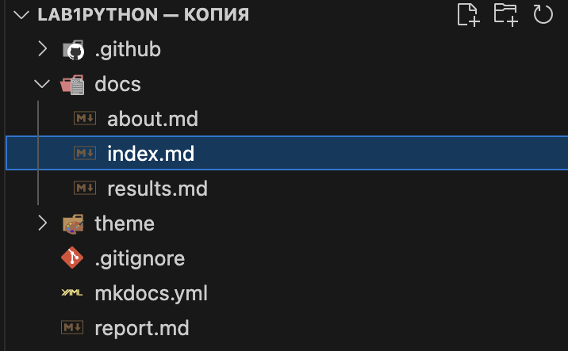
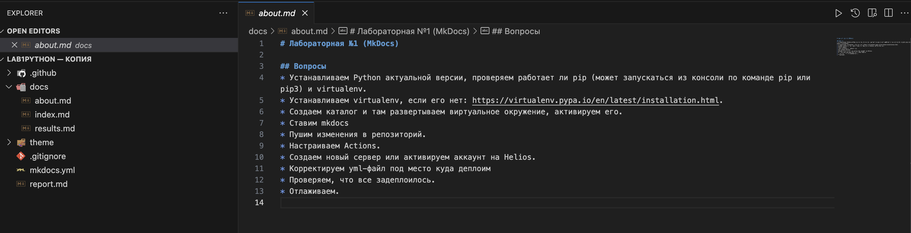
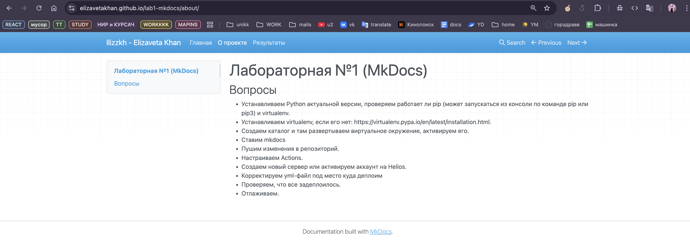

1. Создание шаблона проекта с помощью mkdocs
2. Создание трех страниц: index, about, results

3. Наполнение статического сайта информацией о лабораторной работе

4. Деплой созданного сайта на gh-pages

